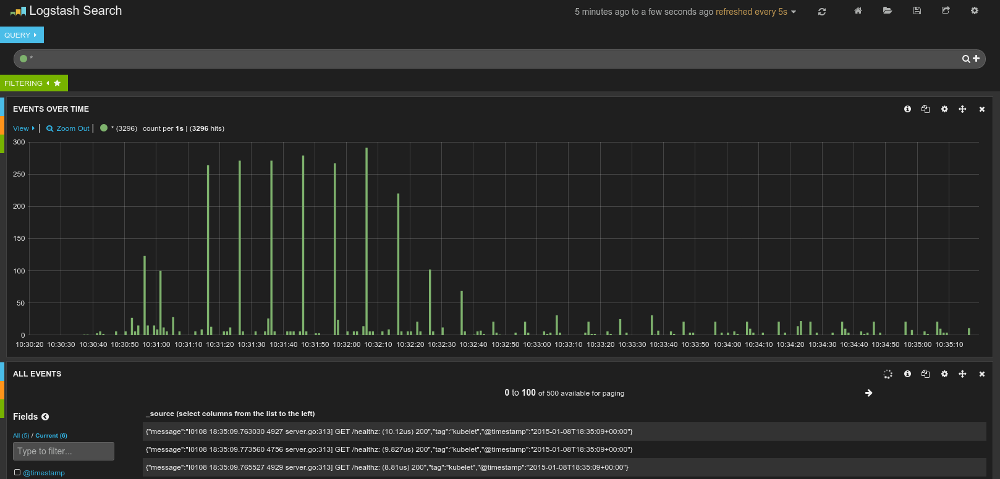

# Logging

## Logging by Kubernetes Components
Kubernetes components, such as kubelet and apiserver, use the [glog](https://godoc.org/github.com/golang/glog) logging library.  Developer conventions for logging severity are described in [devel/logging.md](devel/logging.md).

## Logging in Containers
There are no Kubernetes-specific requirements for logging from within containers. [search](https://www.google.com/?q=docker+container+logging) will turn up any number of articles about logging and
Docker containers.  However, we do provide an example of how to collect, index, and view pod logs [using Fluentd, Elasticsearch, and Kibana](./getting-started-guides/logging.md)


## Logging to Elasticsearch on the GCE platform
Currently the collection of container logs using the [Fluentd](http://www.fluentd.org/) log collector is 
enabled by default for clusters created for the GCE platform. Each node uses Fluentd to collect
the container logs which are submitted in [Logstash](http://logstash.net/docs/1.4.2/tutorials/getting-started-with-logstash)
format (in JSON) to an [Elasticsearch](http://www.elasticsearch.org/) cluster which runs as a Kubernetes service.
As of Kubernetes 0.11, when you create a cluster the console output reports the URL of both the Elasticsearch cluster as well as
a URL for a [Kibana](http://www.elasticsearch.org/overview/kibana/) dashboard viewer for the logs that have been ingested
into Elasticsearch.
```
Elasticsearch is running at https://104.197.10.10/api/v1/proxy/namespaces/default/services/elasticsearch-logging
Kibana is running at https://104.197.10.10/api/v1/proxy/namespaces/default/services/kibana-logging
```
Visiting the Kibana dashboard URL in a browser should give a display like this:


To learn how to query, filter etc. using Kibana you might like to look at this [tutorial](http://www.elasticsearch.org/guide/en/kibana/current/working-with-queries-and-filters.html).

You can check to see if any logs are being ingested into Elasticsearch by curling against its URL. You will need to provide the username and password that was generated when your cluster was created. This can be found in the `kubernetes_auth` file for your cluster.
```
$ curl -k -u admin:Drt3KdRGnoQL6TQM https://130.211.152.93/api/v1/proxy/namespaces/default/services/elasticsearch-logging/_search?size=10
```
A [demonstration](../examples/logging-demo/README.md) of two synthetic logging sources can be used
to check that logging is working correctly.

Cluster logging can be turned on or off using the environment variable `ENABLE_NODE_LOGGING` which is defined in the
`config-default.sh` file for each provider. For the GCE provider this is set by default to `true`. Set this
to `false` to disable cluster logging.

The type of logging is used is specified by the environment variable `LOGGING_DESTINATION` which for the
GCE provider has the default value `elasticsearch`. If this is set to `gcp` for the GCE provider then
logs will be sent to the Google Cloud Logging system instead.

When using Elasticsearch the number of Elasticsearch instances can be controlled by setting the
variable `ELASTICSEARCH_LOGGING_REPLICAS` which has the default value of `1`. For large clusters
or clusters that are generating log information at a high rate you may wish to use more
Elasticsearch instances.


[]()


[]()
